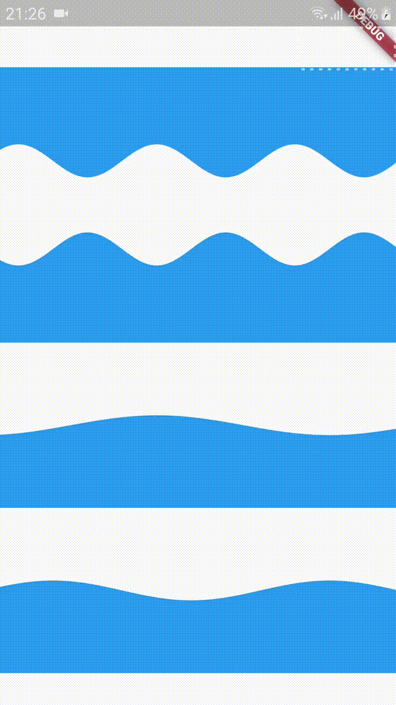
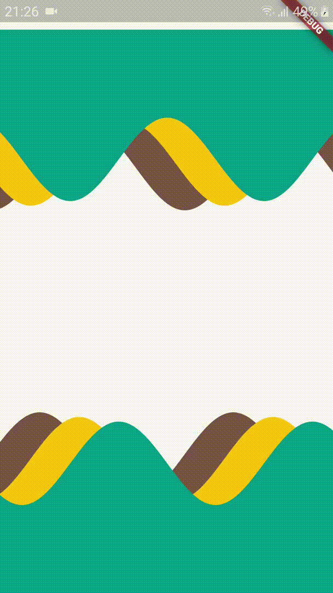
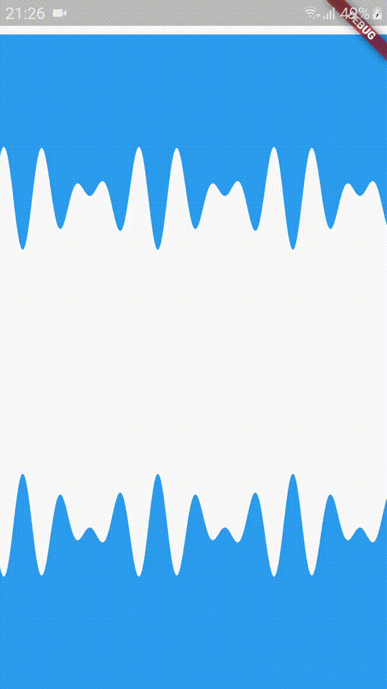

# flutter_sinusoidals

A flutter package which helps visualizing sine waves.


## Features

* Creating a sine wave.
* Creating a stack of sine waves.
* Combine multiple sine waves together.
* Use clipping to achieve wave effect to you can apply wave to any widget. E.g: An AppBar with sine wave.

## Getting started

In the `pubspec.yaml` of your flutter project, add the following dependency:

```yaml
dependencies:
  ...
  flutter_sinusoidals:
```

In your code add the following import:

```dart
import 'package:flutter_sinusoidals/sinusoidal.dart';
```

## Built-in waves

This package comes with 4 kinds of sine waves:

### Sinusoidal

A widget which helps visualize a sinusoidal.



Example of a sinusoidal:

```dart
Sinusoidal(
  model: const SinusoidalModel(
    travelling: true,
    amplitude: 25,
    waves: 2.5,
    frequency: 1.5,
  ),
  child: Container(
    height: 100,
    color: Colors.blue,
  ),
),
```

### Sinusoidals

A widget which helps visualize a stack of sinusoidals.



Example of a sinusoidals:

```dart
Sinusoidals(
  itemCount: 3,
  builder: (context, index) {
    return SinusoidalItem(
      model: SinusoidalModel(
        travelling: true,
        amplitude: _amplitude,
        waves: _waves,
        translate: 5.0 * (index + 1),
        center: 5.0 * (index + 1),
      ),
      child: Container(
        height: _height,
        color: _colors[index],
      ),
    );
  },
);
```

### CombinedWave

A widget which helps visualize a combined wave.

A combined wave is a wave that is formed by adding multiple sinusoidals together.



Example of a combined wave:

```dart
CombinedWave(
  reverse: true,
  models: const [
    SinusoidalModel(
      amplitude: 25,
      waves: 20,
      translate: 2.5,
      frequency: 0.5,
    ),
    SinusoidalModel(
      amplitude: 25,
      waves: 15,
      translate: 7.5,
      frequency: 1.5,
    ),
  ],
  child: Container(
    height: 200,
    color: Colors.blue,
  ),
),
```

### MagmaWave

A pre-defined wave that mimicking magma motion.

This is included in the package just to demonstrate that you can create a crazy awesome wave by combining multiple waves together.


### References

To know how sinusoidal works: [sinusoidal](https://en.wikipedia.org/wiki/Sine_wave)

Try [demos](https://www.desmos.com/calculator/3renylhzcu) to observe how sinusoidal visually works, and create your version by forming formulas.

## Changelog

See the [Changelog](CHANGELOG.md) to know what was changed.

## Contributions

Feel free to contribute to this project.

If you find a bug or want a feature, but don't know how to fix/implement it, please fire an [issue](https://github.com/dungnv2602/flutter_sinusoidals/issues).

If you fixed a bug or implemented a feature, please send a [pull request](https://github.com/dungnv2602/flutter_sinusoidals/pulls).
